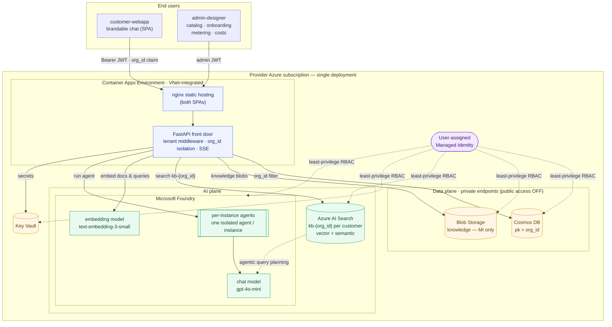
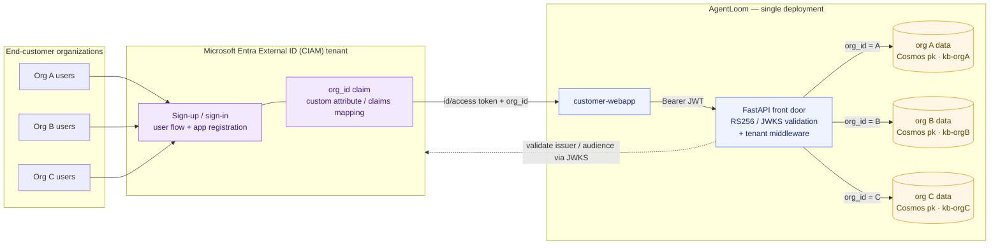

# AgentLoom

> **AgentLoom** is an open-source, multi-tenant SaaS accelerator that lets a
> **provider** company serve AI agents to its small- and medium-sized customers
> in a **centralized SaaS model**, powered by **Microsoft Foundry Agent
> Service** — using a *catalog of templates → per-customer instances* model.
>
> **Note:** this approach is ideal for a **system integrator** that wants to
> manage many customers centrally, without each customer needing their own Azure
> subscription.

The provider installs AgentLoom into **their own** Azure subscription (the
"provider SaaS tenant"). End customers only ever access it through the web; they
own no infrastructure.

- **Product brand is fully customizable** (`PRODUCT_NAME` defaults to *AgentLoom*).
- **Logical multi-tenancy**: a single deployment serves every
  customer; isolation is enforced server-side by an `org_id` claim that the
  client can never override.
- **One isolated Foundry agent per instance**: every template assigned to a
  customer provisions its **own separate, isolated agent in Foundry** (with that
  customer's config + knowledge baked in). The Foundry endpoint is never exposed
  to customers.
- **Retrieval-Augmented Generation (RAG)** per customer: each customer's
  documents are chunked and embedded (`text-embedding-3-small`) into their own
  `kb-{org_id}` Azure AI Search index, then retrieved with vector + semantic
  search to ground every answer. Templates can optionally enable **agentic
  retrieval** (Search plans multi-step queries against a knowledge base using
  the Foundry chat model).
- **Per-customer cost attribution** (multi-currency): the admin **Costs** tab
  breaks the monthly Azure bill (shared platform + LLM tokens + embeddings +
  agentic planning) down per customer, with an end-of-month projection.

---

## Architecture



**Private networking:** Cosmos DB and Blob Storage have **public network access
disabled** (tenant-policy compliant). The Container Apps environment is
**integrated into a VNet** and reaches them over **private endpoints** with
private DNS zones — no traffic over the public internet. Azure AI Search,
Foundry and Key Vault are reached via managed identity over their service
endpoints.

### Production identity: Microsoft Entra External ID (multi-customer)

For the MVP, end-customer auth uses a signed JWT carrying the `org_id` claim. In
production you front it with an **Entra External ID (CIAM)** tenant: every
customer organization signs in through the same user flow, the token carries
their `org_id`, and the **single** AgentLoom deployment keeps each organization
fully isolated server-side — same code, same containers, separate data per
`org_id`.



Only the token verification in [backend/app/security.py](backend/app/security.py)
changes (HS256 → JWKS-based RS256 against your External ID tenant); middleware,
isolation and routers are untouched because they depend only on the
`org_id`/`roles` claims. See [§6 Wire Microsoft Entra External ID](#6-wire-microsoft-entra-external-id-ciam).

**Runtime chat flow:** customer user → front door (authenticates, resolves
`org_id` from the token, enforces isolation) → backend embeds the question and
retrieves the customer's most relevant knowledge chunks from `kb-{org_id}`
(vector + semantic search, or **agentic retrieval** when the instance enables
it) → runs the template's Foundry agent with the customer's config + retrieved
context injected → streams tokens back via **SSE** → records usage (chat,
embedding and agentic planning tokens) in the customer's metering partition.

**Frontend serving:** the two web apps (admin-designer and customer-webapp) are
React + Vite single-page apps. At build time Vite compiles each into static
files (HTML, JS, CSS); these are then served by a lightweight **nginx**
(`nginx:1.29-alpine`) web server on port 80, each in its own Container App — no
Node.js runtime is needed in production.

**One image, many environments — runtime config.** A Vite app normally reads
its configuration (like the backend URL) from `VITE_*` variables that are
**frozen into the JavaScript at build time**. That would force you to rebuild a
separate image for every environment (dev, staging, prod), since each has a
different backend URL. AgentLoom avoids that by injecting the URL **at container
startup** instead:

1. The backend URL is passed to the Container App as an environment variable,
   `API_BASE` (set by the Bicep to the backend's own ingress URL).
2. When the container starts, a small entrypoint script
   (`docker-entrypoint.sh`, installed as
   `/docker-entrypoint.d/99-env-config.sh`) writes that value into a tiny file:
   `env-config.js` → `window.__API_BASE__ = "https://backend…";`.
3. `index.html` loads `<script src="/env-config.js">` **before** the app bundle,
   so by the time the React code runs, `window.__API_BASE__` is already set.
4. The app's `api.ts` reads `window.__API_BASE__` to know where to send
   requests.

Because the URL lives in `env-config.js` (written at startup) and **not** in the
compiled bundle, the *exact same* image built once can be promoted from dev to
prod unchanged — only the `API_BASE` env var differs between environments.

nginx also sets HTTP cache-control headers tuned for SPAs:

- files under `/assets/` have content-hashed names (they change whenever their
  content changes), so they are marked `immutable` and cached aggressively by
  the browser;
- `index.html` and `env-config.js` keep stable names, so they are marked
  `no-cache` — the browser always re-checks them, and a new deploy (new asset
  hashes, new API URL) is picked up immediately.

---

## Repository layout

```
AgentLoom/
├─ azure.yaml                 # azd project (3 services + post-provision hook)
├─ infra/                     # Modular Bicep
│  ├─ main.bicep              # root: network, identity, KV, Cosmos, Search, Storage, ACR, Foundry, ACA
│  └─ modules/*.bicep         # incl. network.bicep (VNet + DNS) + privateEndpoint.bicep
├─ backend/                   # FastAPI front door
│  └─ app/
│     ├─ main.py middleware.py security.py config.py models.py credentials.py
│     ├─ routers/  catalog.py admin.py chat.py branding.py dev_auth.py demo.py
│     └─ services/ cosmos.py search.py blob.py foundry.py embeddings.py agentic.py pricing.py
├─ admin-designer/            # React + Vite + Fluent UI (partner admin) — served by nginx
├─ customer-webapp/           # React + Vite + Fluent UI (customer chat) — served by nginx
├─ scripts/
│  ├─ create_foundry_agents.py  # seeds the agent TEMPLATES (from sample-templates/)
│  ├─ seed_customers.py         # 2 demo customers + instances + indexes + knowledge
│  ├─ reindex_search.py         # re-chunk & re-embed a customer's knowledge into kb-{org}
│  ├─ fetch_azure_prices.py     # refresh config/azure_prices*.json from the Azure price API
│  ├─ mint_demo_token.py        # local JWT for manual testing
│  └─ setup.ps1 / setup.sh      # azd post-provision orchestration
├─ sample-templates/          # agent template blueprints (JSON) — single source of truth
├─ sample-customers/          # demo + manual customers (README + knowledge per customer)
└─ config/
   ├─ branding.json            # partner brand (overridable by env)
   ├─ azure_prices.json        # USD unit prices for the Costs view
   ├─ azure_prices_eur.json    # EUR unit prices
   └─ .env.sample
```

---

## Prerequisites

- [Azure Developer CLI (`azd`)](https://aka.ms/azd) and [Azure CLI (`az`)](https://aka.ms/azcli)
- Docker (azd builds the three container images)
- Python 3.11+ and Node 20+ (only needed to run scripts / develop locally)
- An Azure subscription where you can create AI Services (Foundry), Cosmos DB,
  AI Search, Storage, Key Vault, ACR and Container Apps.
- Sufficient quota for the chosen Foundry models: the chat model (default
  `gpt-4o-mini`) and the embedding model (default `text-embedding-3-small`,
  used for RAG). Both are deployed automatically by the Bicep.

Sign in first:

```bash
az login
azd auth login
```

---

## Deploy with a single `azd up`

```bash
# from the repo root
azd env new agentloom-dev          # pick a name
azd env set AZURE_LOCATION eastus2 # region with Foundry + your model
azd up
```

`azd up` will:

1. Provision all infrastructure from `infra/` (a VNet with private endpoints,
   managed identity, Key Vault, private Storage, Cosmos, AI Search, ACR, Foundry
   account+project + chat & embedding models, and a VNet-integrated Container
   Apps environment with three Container Apps that scale to zero).
2. Build and push the backend + two web app images to ACR.
3. Run the **post-provision hook** (`scripts/setup.*`), which:
   - seeds the **agent templates** from
     [`sample-templates/`](./sample-templates/) (`create_foundry_agents.py`), and
   - seeds the **2 demo customers** with instances, Search indexes and private
     knowledge (`seed_customers.py`).

At the end, azd prints the three URLs (`BACKEND_URL`, `ADMIN_URL`,
`CUSTOMER_URL`).

> If the post-provision hook fails because your user lacks Foundry/Cosmos data
> roles, the Bicep already grants them to the deployer — just re-run
> `azd hooks run postprovision` once the role assignments have propagated.

### Install with or without templates & demo customers

Both the agent templates and the demo customers are seeded by default. Each is
defined as files (single source of truth) and gated by an env flag, so you can
choose exactly what gets installed:

| Flag (`azd env set …`) | Default | Effect when `false` |
|---|---|---|
| `SEED_TEMPLATES false` | seed | Skip the agent templates in [`sample-templates/`](./sample-templates/) |
| `SEED_DEMO_CUSTOMERS false` | seed | Skip the demo customers in [`sample-customers/`](./sample-customers/) |

```bash
# Clean install: no templates, no demo customers (empty catalog)
azd env set SEED_TEMPLATES false
azd env set SEED_DEMO_CUSTOMERS false
azd up

# Templates only, no demo customers
azd env set SEED_DEMO_CUSTOMERS false
azd up
```

> The demo customers reference template ids, so disabling templates while
> keeping demo customers will fail to find a template — disable both, or keep
> templates enabled. Flags are honored by the post-provision hook and by the
> seed scripts directly (`SEED_TEMPLATES`, `SEED_DEMO_CUSTOMERS` env vars).

The other sample customers (Aurelia Motors, Stride Labs) are always **manual** —
onboard them from the Admin Console using their folder `README.md`.

---

## Partner customization

Everything a partner needs to rebrand and re-home the accelerator is config —
**no code changes**.

### 1. Brand

Edit [config/branding.json](config/branding.json) **or** set env vars (env wins):

| Setting           | Env var              | Default                              |
| ----------------- | -------------------- | ------------------------------------ |
| Product name      | `PRODUCT_NAME`       | `AgentLoom`                          |
| Tagline           | `PRODUCT_TAGLINE`    | `Weave agents for every customer`    |
| Primary color     | `PRIMARY_COLOR`      | `#138DDE`                            |
| Logo URL          | `LOGO_URL`           | `/logo.svg`                          |

The backend exposes a resolved brand per customer at `GET /v1/branding`
(global brand overlaid with the customer's own branding). The web apps read
`public/branding.json` at load, with `VITE_*` overrides.

### 2. Resource prefix (clean re-install)

All Azure resource names derive from `AZURE_RESOURCE_PREFIX` (default
`agentloom`) + a unique suffix:

```bash
azd env set AZURE_RESOURCE_PREFIX contoso
```

### 3. Add your own templates

Either use the **Designer → Templates** UI, or add entries to
`scripts/create_foundry_agents.py` (each gets a real Foundry `agent_id`) and
re-run it. Publish a template to make it visible in `GET /v1/catalog`.

### 4. Onboard your own customers

In **Designer → Customers**, create a customer (its `org_id`, tier/quota and
branding). Saving auto-creates the per-customer Search index `kb-{org_id}`.
Then assign templates and upload knowledge in **Designer → Instances** — uploaded
documents are chunked and embedded into the customer's index for RAG. If the
template allows it, toggle **agentic retrieval** per instance (this provisions a
Search knowledge source `ks-{org}` + knowledge base `kbagent-{org}`).

### 5. Track per-customer costs

**Designer → Costs** shows the monthly Azure spend split per customer: the fixed
shared platform plus variable AI usage (LLM chat tokens, embeddings, agentic
planning). Switch the display currency (USD/EUR) and read the end-of-month
projection. Prices live in `config/azure_prices.json` (and
`config/azure_prices_<cur>.json` per currency, refreshable with
`scripts/fetch_azure_prices.py`) and are loaded by
`backend/app/services/pricing.py`.

### 6. Wire Microsoft Entra External ID (CIAM)

For the MVP, end-customer auth uses a validated **HS256 JWT** carrying an
`org_id` claim (and optional `roles`). To move to production:

1. Create an **Entra External ID** (CIAM) tenant and a user flow.
2. Add an `org_id` claim to the token (custom attribute / claims mapping).
3. Replace the verification in [backend/app/security.py](backend/app/security.py)
   with JWKS-based RS256 validation against your External ID tenant
   (`issuer`, `audience`, and the published `jwks_uri`). The rest of the app —
   middleware, isolation, routers — is unchanged because it only depends on the
   `org_id`/`roles` claims.

Do **not** use B2B guest users in the partner tenant for customer identities.

---

## Local development

```bash
# Backend (uses your az login credentials via DefaultAzureCredential)
cd backend && pip install -r requirements.txt
$env:ALLOW_DEV_TOKENS = "true"   # enables POST /v1/auth/dev-token (dev only!)
uvicorn app.main:app --reload --port 8000

# Admin designer
cd admin-designer && npm install && npm run dev   # http://localhost:5173

# Customer webapp
cd customer-webapp && npm install && npm run dev   # http://localhost:5174
```

Mint an admin token for the Designer:

```bash
python scripts/mint_demo_token.py _system admin-user admin
# paste it into the Designer header "Admin JWT" box
```

The customer-webapp's demo switcher calls `/v1/auth/dev-token` automatically
(only works when `ALLOW_DEV_TOKENS=true`).

---

## Demo data

| Customer (`org_id`)        | Template assigned          | Knowledge                          |
| -------------------------- | -------------------------- | ---------------------------------- |
| Horizon Travel (`horizon-travel`) | Customer Care Assistant | Bookings, refunds, baggage FAQs |
| NovaTech Solutions (`novatech`)   | Knowledge / FAQ Assistant | Support contracts, SLAs FAQs   |

Each demo instance also ships **suggested questions** that appear as clickable
chips on the customer-webapp welcome screen (configurable per instance in the
Designer's *Assign template* form).

Try in the customer-webapp: *"What is your refund policy?"* (Horizon) or
*"What's included in a support contract?"* (NovaTech).

---

## Security & policy notes

- ⛔ **No public blob.** Storage is created with `allowBlobPublicAccess=false`,
  `allowSharedKeyAccess=false`, OAuth-only; the `knowledge` container is
  `publicAccess: None`. Access is via managed identity only.
- 🔐 **No keys/connection strings in code.** Cosmos, Search and Storage all have
  local auth disabled; the backend authenticates with a **user-assigned managed
  identity**. Secrets (if any) live in **Key Vault** and are read via MI.
- 🛡️ **Non-bypassable tenant isolation.** `org_id` is taken only from the
  verified token claim. Every Cosmos/Search query is forced on `org_id`; an
  org-A token targeting an org-B path returns **403** (verified by the included
  middleware tests).
- 🧱 **Least-privilege RBAC.** The managed identity gets exactly: Cosmos DB
  Built-in Data Contributor, Search Index Data Contributor + Service
  Contributor, Storage Blob Data Contributor, Key Vault Secrets User, AcrPull,
  and Azure AI User on Foundry. The Search service's own identity gets Cognitive
  Services User on Foundry so it can call the chat model for agentic retrieval
  query planning.
- 🌐 **HTTPS + CORS + security headers.** Container Apps ingress is HTTPS-only
  (`allowInsecure=false`); CORS is restricted to the web origins; responses set
  `X-Content-Type-Options`, `X-Frame-Options`, `Referrer-Policy` and HSTS.
- 📊 **Diagnostics** flow to Log Analytics; all resources are tagged.

---

## Acceptance checklist

| # | Criterion | Where |
| - | --------- | ----- |
| 1 | `azd up` provisions with no public blob, MI, Key Vault, least-privilege RBAC, no plaintext secrets | `infra/` |
| 2 | Scripts create 2 Foundry templates + 2 demo customers with instances & knowledge | `scripts/` |
| 3 | Designer: view/create templates, onboard customer, assign instances, view metering & per-customer costs | `admin-designer/` |
| 4 | customer-webapp streams chat with the customer's agent using ITS knowledge (RAG / agentic retrieval); cross-tenant → 403 | `customer-webapp/`, `backend/app/middleware.py` |
| 5 | This README with install + customization steps | here |

---

## License

MIT. Contributions welcome.
