# AgentLoom

> **AgentLoom** is an open-source, multi-tenant SaaS accelerator that lets a
> Microsoft **partner** offer their SMB customers AI agents powered by
> **Microsoft Foundry Agent Service** — using a *catalog of templates →
> per-customer instances* model.

The partner installs AgentLoom into **their own** Azure subscription (the
"partner SaaS tenant"). End customers only ever access it through the web; they
own no infrastructure.

- **Product brand is fully customizable** (`PRODUCT_NAME` defaults to *AgentLoom*).
- **Logical multi-tenancy** (Option B): a single deployment serves every
  customer; isolation is enforced server-side by an `org_id` claim that the
  client can never override.
- **One Foundry agent per template** (shared parametric model): per-customer
  config + knowledge are injected at runtime, and the Foundry endpoint is never
  exposed to customers.

---

## Architecture

```mermaid
flowchart LR
    subgraph Customer["Customer browser"]
      CW[customer-webapp<br/>brandable chat]
    end
    subgraph Partner["Partner admin"]
      AD[admin-designer<br/>catalog · onboarding · metering]
    end

    subgraph Azure["Partner Azure subscription (single deployment)"]
      direction TB
      subgraph VNet["Virtual network"]
        ENV[Container Apps Environment<br/>VNet-integrated]
        FE[FastAPI front door<br/>+ tenant middleware]
        PE{{Private endpoints}}
        ENV --- FE
      end
      COS[(Cosmos DB<br/>pk = org_id<br/>public access DISABLED)]
      SR[(Azure AI Search<br/>kb-&#123;org_id&#125; index/customer)]
      BL[(Blob Storage<br/>PRIVATE — MI only<br/>public access DISABLED)]
      KV[(Key Vault)]
      MI([User-assigned<br/>Managed Identity])
      FA[[Microsoft Foundry<br/>Agent Service]]
    end

    CW -- "Bearer JWT (org_id claim)" --> FE
    AD -- "admin JWT" --> FE
    FE -- org_id filter --> PE -. private link .-> COS
    FE -- MI --> PE -. private link .-> BL
    FE -- org_id filter --> SR
    FE -- MI --> KV
    FE -- MI --> FA
    MI -. least-privilege RBAC .-> COS & SR & BL & KV & FA
```



**Private networking:** Cosmos DB and Blob Storage have **public network access
disabled** (tenant-policy compliant). The Container Apps environment is
**integrated into a VNet** and reaches them over **private endpoints** with
private DNS zones — no traffic over the public internet. Azure AI Search,
Foundry and Key Vault are reached via managed identity over their service
endpoints.

**Runtime chat flow:** customer user → front door (authenticates, resolves
`org_id` from the token, enforces isolation) → backend retrieves the customer's
knowledge from `kb-{org_id}` → runs the template's Foundry agent with the
customer's config injected → streams tokens back via **SSE** → records usage in
the customer's metering partition.

**Frontend serving:** both SPAs are built statically (Vite) and served by
**nginx** (`nginx:1.27-alpine`) on port 80 in their own Container App. The API
base URL is injected **at container start** into `env-config.js` (no rebuild per
environment), and nginx sets cache-control headers — hashed `/assets/` are
`immutable`, while `index.html` and `env-config.js` are `no-cache` so new
deploys are picked up immediately.

---

## Repository layout

```
AgentLoom/
├─ azure.yaml                 # azd project (3 services + post-provision hook)
├─ infra/                     # Modular Bicep
│  ├─ main.bicep              # root: network, identity, KV, Cosmos, Search, Storage, ACR, Foundry, ACA
│  └─ modules/*.bicep         # incl. network.bicep (VNet + DNS) + privateEndpoint.bicep
├─ backend/                   # FastAPI front door
│  └─ app/
│     ├─ main.py middleware.py security.py config.py models.py credentials.py
│     ├─ routers/  catalog.py admin.py chat.py branding.py dev_auth.py demo.py
│     └─ services/ cosmos.py search.py blob.py foundry.py
├─ admin-designer/            # React + Vite + Fluent UI (partner admin) — served by nginx
├─ customer-webapp/           # React + Vite + Fluent UI (customer chat) — served by nginx
├─ scripts/
│  ├─ create_foundry_agents.py  # creates the TEMPLATE agents in Foundry
│  ├─ seed_customers.py         # 2 demo customers + instances + indexes + knowledge
│  ├─ mint_demo_token.py        # local JWT for manual testing
│  └─ setup.ps1 / setup.sh      # azd post-provision orchestration
└─ config/
   ├─ branding.json            # partner brand (overridable by env)
   └─ .env.sample
```

---

## Prerequisites

- [Azure Developer CLI (`azd`)](https://aka.ms/azd) and [Azure CLI (`az`)](https://aka.ms/azcli)
- Docker (azd builds the three container images)
- Python 3.11+ and Node 20+ (only needed to run scripts / develop locally)
- An Azure subscription where you can create AI Services (Foundry), Cosmos DB,
  AI Search, Storage, Key Vault, ACR and Container Apps.
- Sufficient quota for the chosen Foundry model (default `gpt-4o-mini`).

Sign in first:

```bash
az login
azd auth login
```

---

## Deploy with a single `azd up`

```bash
# from the repo root
azd env new agentloom-dev          # pick a name
azd env set AZURE_LOCATION eastus2 # region with Foundry + your model
azd up
```

`azd up` will:

1. Provision all infrastructure from `infra/` (a VNet with private endpoints,
   managed identity, Key Vault, private Storage, Cosmos, AI Search, ACR, Foundry
   account+project+model, and a VNet-integrated Container Apps environment with
   three Container Apps that scale to zero).
2. Build and push the backend + two web app images to ACR.
3. Run the **post-provision hook** (`scripts/setup.*`), which:
   - creates the **2 Foundry agent templates** (`create_foundry_agents.py`), and
   - seeds the **2 demo customers** with instances, Search indexes and private
     knowledge (`seed_customers.py`).

At the end, azd prints the three URLs (`BACKEND_URL`, `ADMIN_URL`,
`CUSTOMER_URL`).

> If the post-provision hook fails because your user lacks Foundry/Cosmos data
> roles, the Bicep already grants them to the deployer — just re-run
> `azd hooks run postprovision` once the role assignments have propagated.

---

## Partner customization

Everything a partner needs to rebrand and re-home the accelerator is config —
**no code changes**.

### 1. Brand

Edit [config/branding.json](config/branding.json) **or** set env vars (env wins):

| Setting           | Env var              | Default                              |
| ----------------- | -------------------- | ------------------------------------ |
| Product name      | `PRODUCT_NAME`       | `AgentLoom`                          |
| Tagline           | `PRODUCT_TAGLINE`    | `Weave agents for every customer`    |
| Primary color     | `PRIMARY_COLOR`      | `#138DDE`                            |
| Logo URL          | `LOGO_URL`           | `/logo.svg`                          |

The backend exposes a resolved brand per customer at `GET /v1/branding`
(global brand overlaid with the customer's own branding). The web apps read
`public/branding.json` at load, with `VITE_*` overrides.

### 2. Resource prefix (clean re-install)

All Azure resource names derive from `AZURE_RESOURCE_PREFIX` (default
`agentloom`) + a unique suffix:

```bash
azd env set AZURE_RESOURCE_PREFIX contoso
```

### 3. Add your own templates

Either use the **Designer → Templates** UI, or add entries to
`scripts/create_foundry_agents.py` (each gets a real Foundry `agent_id`) and
re-run it. Publish a template to make it visible in `GET /v1/catalog`.

### 4. Onboard your own customers

In **Designer → Customers**, create a customer (its `org_id`, tier/quota and
branding). Saving auto-creates the per-customer Search index `kb-{org_id}`.
Then assign templates and upload knowledge in **Designer → Instances**.

### 5. Wire Microsoft Entra External ID (CIAM)

For the MVP, end-customer auth uses a validated **HS256 JWT** carrying an
`org_id` claim (and optional `roles`). To move to production:

1. Create an **Entra External ID** (CIAM) tenant and a user flow.
2. Add an `org_id` claim to the token (custom attribute / claims mapping).
3. Replace the verification in [backend/app/security.py](backend/app/security.py)
   with JWKS-based RS256 validation against your External ID tenant
   (`issuer`, `audience`, and the published `jwks_uri`). The rest of the app —
   middleware, isolation, routers — is unchanged because it only depends on the
   `org_id`/`roles` claims.

Do **not** use B2B guest users in the partner tenant for customer identities.

---

## Local development

```bash
# Backend (uses your az login credentials via DefaultAzureCredential)
cd backend && pip install -r requirements.txt
$env:ALLOW_DEV_TOKENS = "true"   # enables POST /v1/auth/dev-token (dev only!)
uvicorn app.main:app --reload --port 8000

# Admin designer
cd admin-designer && npm install && npm run dev   # http://localhost:5173

# Customer webapp
cd customer-webapp && npm install && npm run dev   # http://localhost:5174
```

Mint an admin token for the Designer:

```bash
python scripts/mint_demo_token.py _system admin-user admin
# paste it into the Designer header "Admin JWT" box
```

The customer-webapp's demo switcher calls `/v1/auth/dev-token` automatically
(only works when `ALLOW_DEV_TOKENS=true`).

---

## Demo data

| Customer (`org_id`)        | Template assigned          | Knowledge                          |
| -------------------------- | -------------------------- | ---------------------------------- |
| Horizon Travel (`horizon-travel`) | Customer Care Assistant | Bookings, refunds, baggage FAQs |
| NovaTech Solutions (`novatech`)   | Knowledge / FAQ Assistant | Support contracts, SLAs FAQs   |

Each demo instance also ships **suggested questions** that appear as clickable
chips on the customer-webapp welcome screen (configurable per instance in the
Designer's *Assign template* form).

Try in the customer-webapp: *"What is your refund policy?"* (Horizon) or
*"What's included in a support contract?"* (NovaTech).

---

## Security & policy notes

- ⛔ **No public blob.** Storage is created with `allowBlobPublicAccess=false`,
  `allowSharedKeyAccess=false`, OAuth-only; the `knowledge` container is
  `publicAccess: None`. Access is via managed identity only.
- 🔐 **No keys/connection strings in code.** Cosmos, Search and Storage all have
  local auth disabled; the backend authenticates with a **user-assigned managed
  identity**. Secrets (if any) live in **Key Vault** and are read via MI.
- 🛡️ **Non-bypassable tenant isolation.** `org_id` is taken only from the
  verified token claim. Every Cosmos/Search query is forced on `org_id`; an
  org-A token targeting an org-B path returns **403** (verified by the included
  middleware tests).
- 🧱 **Least-privilege RBAC.** The managed identity gets exactly: Cosmos DB
  Built-in Data Contributor, Search Index Data Contributor + Service
  Contributor, Storage Blob Data Contributor, Key Vault Secrets User, AcrPull,
  and Azure AI User on Foundry.
- 🌐 **HTTPS + CORS + security headers.** Container Apps ingress is HTTPS-only
  (`allowInsecure=false`); CORS is restricted to the web origins; responses set
  `X-Content-Type-Options`, `X-Frame-Options`, `Referrer-Policy` and HSTS.
- 📊 **Diagnostics** flow to Log Analytics; all resources are tagged.

---

## Acceptance checklist

| # | Criterion | Where |
| - | --------- | ----- |
| 1 | `azd up` provisions with no public blob, MI, Key Vault, least-privilege RBAC, no plaintext secrets | `infra/` |
| 2 | Scripts create 2 Foundry templates + 2 demo customers with instances & knowledge | `scripts/` |
| 3 | Designer: view/create templates, onboard customer, assign instances, view metering | `admin-designer/` |
| 4 | customer-webapp streams chat with the customer's agent using ITS knowledge; cross-tenant → 403 | `customer-webapp/`, `backend/app/middleware.py` |
| 5 | This README with install + customization steps | here |

---

## License

MIT. Contributions welcome.
