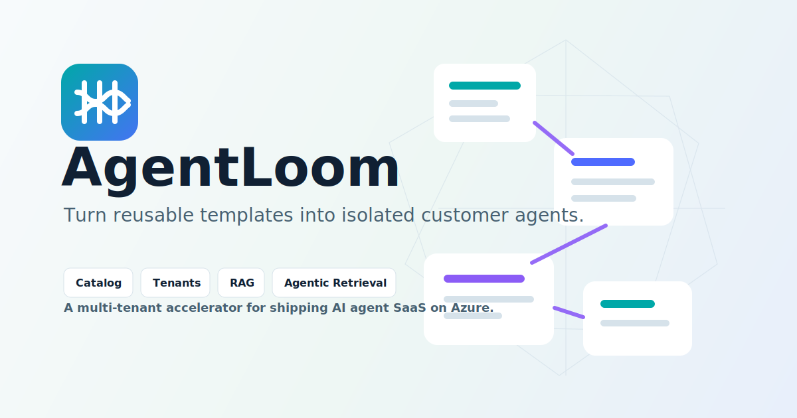
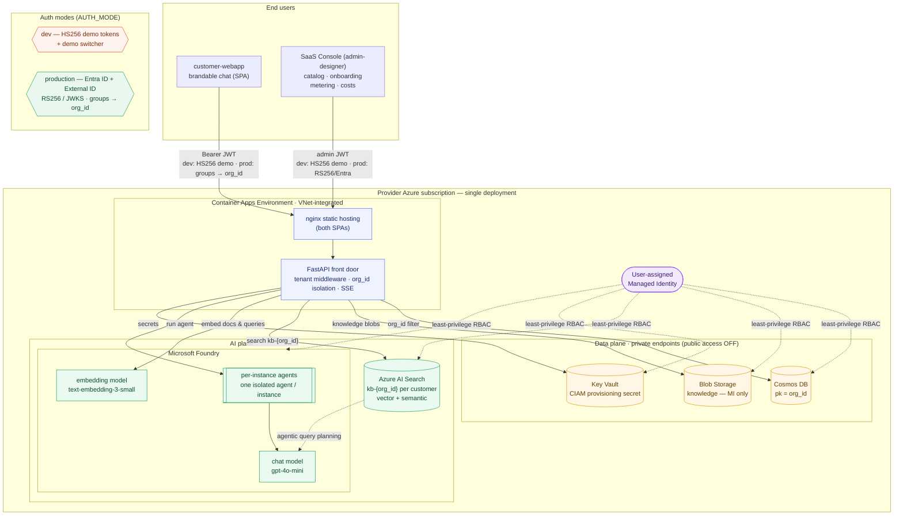
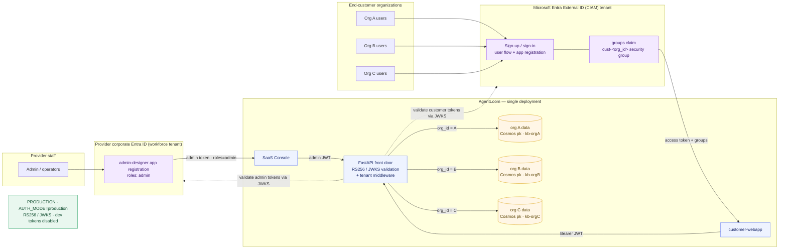
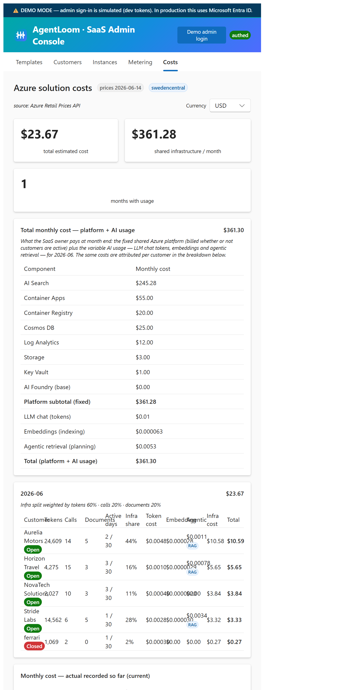
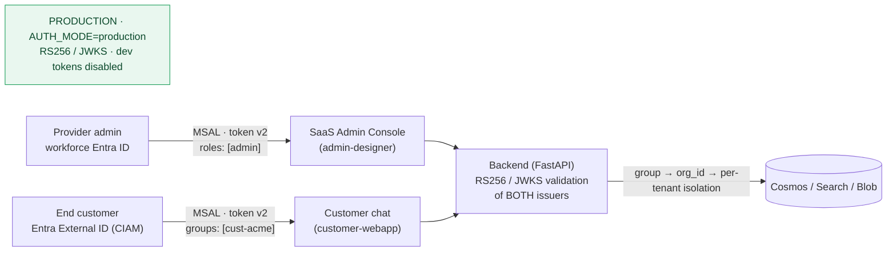

# AgentLoom

> **AgentLoom** is an open-source, multi-tenant SaaS accelerator that lets a
> **provider** company serve AI agents to its small- and medium-sized customers
> in a **centralized SaaS model**, powered by **Microsoft Foundry Agent
> Service** — using a *catalog of templates → per-customer instances* model.
>
> **Note:** this approach is ideal for a **system integrator** that wants to
> manage many customers centrally, without each customer needing their own Azure
> subscription.

The provider installs AgentLoom into **their own** Azure subscription (the
"provider SaaS tenant"). End customers only ever access it through the web; they
own no infrastructure.

- **Product brand is fully customizable** (`PRODUCT_NAME` defaults to *AgentLoom*).
- **Logical multi-tenancy**: a single deployment serves every
  customer; isolation is enforced server-side by an `org_id` claim that the
  client can never override.
- **One isolated Foundry agent per instance**: every template assigned to a
  customer provisions its **own separate, isolated agent in Foundry** (with that
  customer's config + knowledge baked in). The Foundry endpoint is never exposed
  to customers.
- **Retrieval-Augmented Generation (RAG)** per customer: each customer's
  documents are chunked and embedded (`text-embedding-3-small`) into their own
  `kb-{org_id}` Azure AI Search index, then retrieved with vector + semantic
  search to ground every answer. Templates can optionally enable **agentic
  retrieval** (Search plans multi-step queries against a knowledge base using
  the Foundry chat model).
- **Per-customer cost attribution** (multi-currency): the admin **Costs** tab
  breaks the monthly Azure bill (shared platform + LLM tokens + embeddings +
  agentic planning) down per customer, with an end-of-month projection.

---

## Architecture



**Private networking:** Cosmos DB and Blob Storage have **public network access
disabled** (tenant-policy compliant). The Container Apps environment is
**integrated into a VNet** and reaches them over **private endpoints** with
private DNS zones — no traffic over the public internet. Azure AI Search,
Foundry and Key Vault are reached via managed identity over their service
endpoints.

### Production identity: Microsoft Entra External ID (multi-customer)

For the MVP, end-customer auth uses a signed JWT carrying the `org_id` claim. In
production you front it with an **Entra External ID (CIAM)** tenant: every
customer organization signs in through the same user flow, and each customer is
mapped to its `org_id` via a dedicated **security group** (`cust-<org_id>`) — the
token carries the user's group membership, and the **single** AgentLoom
deployment resolves the `org_id` from that group and keeps each organization
fully isolated server-side — same code, same containers, separate data per
`org_id`.

**Two identity providers, two audiences.** End customers sign in via **Entra
External ID (CIAM)**, while the provider's own staff sign in to the
admin-designer via the provider's **corporate Entra ID (workforce) tenant** — an
admin is an internal employee, *not* an External ID consumer. The front door
accepts both: customer tokens (audience = customer app, carry a `groups` claim
that maps to a tenant) and admin tokens (audience = admin app, carry `roles`
incl. `admin`, and `org_id` is set to `_system`).



Adopting Entra requires changing **only one file**: the token-verification
helper in [backend/app/security.py](backend/app/security.py). Today (MVP) it
checks tokens signed with **HS256** — a single shared secret used both to sign
and to verify. In production you switch it to **RS256 verified via JWKS**: the
backend no longer holds any signing secret; instead it downloads the public
keys from your Entra tenants' JWKS endpoints and uses them to verify each
token's signature, issuer and audience. (Why RS256 + JWKS is the secure,
no-shared-secret choice is explained in §6.) Nothing else moves: the tenant
middleware, the per-`org_id` isolation and all routers keep working unchanged,
because they only ever read the resolved `org_id` / `roles` from the validated
token — they don't care *how* it was validated or how the `org_id` was resolved
(in production it comes from the customer's `groups` claim). See
[§6 Wire Microsoft Entra External ID](#6-wire-microsoft-entra-external-id-ciam).

**Runtime chat flow:** customer user → front door (authenticates, resolves
`org_id` from the token, enforces isolation) → backend embeds the question and
retrieves the customer's most relevant knowledge chunks from `kb-{org_id}`
(vector + semantic search, or **agentic retrieval** when the instance enables
it) → runs the template's Foundry agent with the customer's config + retrieved
context injected → streams tokens back via **SSE** → records usage (chat,
embedding and agentic planning tokens) in the customer's metering partition.

**Frontend serving:** the two web apps (admin-designer and customer-webapp) are
React + Vite single-page apps. At build time Vite compiles each into static
files (HTML, JS, CSS); these are then served by a lightweight **nginx**
(`nginx:1.29-alpine`) web server on port 80, each in its own Container App — no
Node.js runtime is needed in production.

**One image, many environments — runtime config.** A Vite app normally reads
its configuration (like the backend URL) from `VITE_*` variables that are
**frozen into the JavaScript at build time**. That would force you to rebuild a
separate image for every environment (dev, staging, prod), since each has a
different backend URL. AgentLoom avoids that by injecting the URL **at container
startup** instead:

1. The backend URL is passed to the Container App as an environment variable,
   `API_BASE` (set by the Bicep to the backend's own ingress URL).
2. When the container starts, a small entrypoint script
   (`docker-entrypoint.sh`, installed as
   `/docker-entrypoint.d/99-env-config.sh`) writes that value into a tiny file:
   `env-config.js` → `window.__API_BASE__ = "https://backend…";`.
3. `index.html` loads `<script src="/env-config.js">` **before** the app bundle,
   so by the time the React code runs, `window.__API_BASE__` is already set.
4. The app's `api.ts` reads `window.__API_BASE__` to know where to send
   requests.

Because the URL lives in `env-config.js` (written at startup) and **not** in the
compiled bundle, the *exact same* image built once can be promoted from dev to
prod unchanged — only the `API_BASE` env var differs between environments.

nginx also sets HTTP cache-control headers tuned for SPAs:

- files under `/assets/` have content-hashed names (they change whenever their
  content changes), so they are marked `immutable` and cached aggressively by
  the browser;
- `index.html` and `env-config.js` keep stable names, so they are marked
  `no-cache` — the browser always re-checks them, and a new deploy (new asset
  hashes, new API URL) is picked up immediately.

---

## Repository layout

```
AgentLoom/
├─ azure.yaml                 # azd project (3 services + post-provision hook)
├─ infra/                     # Modular Bicep
│  ├─ main.bicep              # root: network, identity, KV, Cosmos, Search, Storage, ACR, Foundry, ACA
│  └─ modules/*.bicep         # incl. network.bicep (VNet + DNS) + privateEndpoint.bicep
├─ backend/                   # FastAPI front door
│  └─ app/
│     ├─ main.py middleware.py security.py config.py models.py credentials.py
│     ├─ routers/  catalog.py admin.py chat.py branding.py dev_auth.py demo.py
│     └─ services/ cosmos.py search.py blob.py foundry.py embeddings.py agentic.py pricing.py
├─ admin-designer/            # SaaS Console — React + Vite + Fluent UI (provider admin), served by nginx
├─ customer-webapp/           # React + Vite + Fluent UI (customer chat) — served by nginx
├─ scripts/
│  ├─ create_foundry_agents.py  # seeds the agent TEMPLATES (from sample-templates/)
│  ├─ seed_customers.py         # 2 demo customers + instances + indexes + knowledge
│  ├─ reindex_search.py         # re-chunk & re-embed a customer's knowledge into kb-{org}
│  ├─ fetch_azure_prices.py     # refresh config/azure_prices*.json from the Azure price API
│  ├─ mint_demo_token.py        # local JWT for manual testing
│  └─ setup.ps1 / setup.sh      # azd post-provision orchestration
├─ sample-templates/          # agent template blueprints (JSON) — single source of truth
├─ sample-customers/          # demo + manual customers (README + knowledge per customer)
└─ config/
   ├─ branding.json            # provider brand (overridable by env)
   ├─ azure_prices.json        # USD unit prices for the Costs view
   ├─ azure_prices_eur.json    # EUR unit prices
   └─ .env.sample
```

---

## Prerequisites

- [Azure Developer CLI (`azd`)](https://aka.ms/azd) and [Azure CLI (`az`)](https://aka.ms/azcli)
- Docker (azd builds the three container images)
- Python 3.11+ and Node 20+ (only needed to run scripts / develop locally)
- An Azure subscription where you can create AI Services (Foundry), Cosmos DB,
  AI Search, Storage, Key Vault, ACR and Container Apps.
- Sufficient quota for the chosen Foundry models: the chat model (default
  `gpt-4o-mini`) and the embedding model (default `text-embedding-3-small`,
  used for RAG). Both are deployed automatically by the Bicep.

Sign in first:

```bash
az login
azd auth login
```

---

## Deploy with a single `azd up`

```bash
# from the repo root
azd env new agentloom-dev          # pick a name
azd env set AZURE_LOCATION eastus2 # region with Foundry + your model
azd up
```

`azd up` will:

1. Provision all infrastructure from `infra/` (a VNet with private endpoints,
   managed identity, Key Vault, private Storage, Cosmos, AI Search, ACR, Foundry
   account+project + chat & embedding models, and a VNet-integrated Container
   Apps environment with three Container Apps that scale to zero).
2. Build and push the backend + two web app images to ACR.
3. Run the **post-provision hook** (`scripts/setup.*`), which:
   - seeds the **agent templates** from
     [`sample-templates/`](./sample-templates/) (`create_foundry_agents.py`), and
   - seeds the **2 demo customers** with instances, Search indexes and private
     knowledge (`seed_customers.py`).

At the end, azd prints the three URLs (`BACKEND_URL`, `ADMIN_URL`,
`CUSTOMER_URL`).

> If the post-provision hook fails because your user lacks Foundry/Cosmos data
> roles, the Bicep already grants them to the deployer — just re-run
> `azd hooks run postprovision` once the role assignments have propagated.

### Install with or without templates & demo customers

Both the agent templates and the demo customers are seeded by default. Each is
defined as files (single source of truth) and gated by an env flag, so you can
choose exactly what gets installed:

| Flag (`azd env set …`) | Default | Effect when `false` |
|---|---|---|
| `SEED_TEMPLATES false` | seed | Skip the agent templates in [`sample-templates/`](./sample-templates/) |
| `SEED_DEMO_CUSTOMERS false` | seed | Skip the demo customers in [`sample-customers/`](./sample-customers/) |

```bash
# Clean install: no templates, no demo customers (empty catalog)
azd env set SEED_TEMPLATES false
azd env set SEED_DEMO_CUSTOMERS false
azd up

# Templates only, no demo customers
azd env set SEED_DEMO_CUSTOMERS false
azd up
```

> The demo customers reference template ids, so disabling templates while
> keeping demo customers will fail to find a template — disable both, or keep
> templates enabled. Flags are honored by the post-provision hook and by the
> seed scripts directly (`SEED_TEMPLATES`, `SEED_DEMO_CUSTOMERS` env vars).

The other sample customers (Aurelia Motors, Stride Labs) are always **manual** —
onboard them from the Admin Console using their folder `README.md`.

---

## Walkthrough

See the two apps in action — the provider's **SaaS Admin Console** (catalog →
customers → instances → metering → costs) and the brandable **customer chat**.

<a href="docs/WALKTHROUGH.md">
  
</a>

➡️ **[Take the full visual tour →](docs/WALKTHROUGH.md)**

---

## Provider customization

Everything a provider needs to rebrand and re-home the accelerator is config —
**no code changes**.

### 1. Brand

Edit [config/branding.json](config/branding.json) **or** set env vars (env wins):

| Setting           | Env var              | Default                              |
| ----------------- | -------------------- | ------------------------------------ |
| Product name      | `PRODUCT_NAME`       | `AgentLoom`                          |
| Tagline           | `PRODUCT_TAGLINE`    | `Weave agents for every customer`    |
| Primary color     | `PRIMARY_COLOR`      | `#138DDE`                            |
| Logo URL          | `LOGO_URL`           | `/logo.svg`                          |

The backend exposes a resolved brand per customer at `GET /v1/branding`
(global brand overlaid with the customer's own branding). The web apps read
`public/branding.json` at load, with `VITE_*` overrides.

### 2. Resource prefix (clean re-install)

All Azure resource names derive from `AZURE_RESOURCE_PREFIX` (default
`agentloom`) + a unique suffix:

```bash
azd env set AZURE_RESOURCE_PREFIX contoso
```

### 3. Add your own templates

Either use the **SaaS Console → Templates** UI, or add entries to
`scripts/create_foundry_agents.py` (each gets a real Foundry `agent_id`) and
re-run it. Publish a template to make it visible in `GET /v1/catalog`.

### 4. Onboard your own customers

In **SaaS Console → Customers**, create a customer (its `org_id`, tier/quota and
branding). Saving auto-creates the per-customer Search index `kb-{org_id}`.
Then assign templates and upload knowledge in **SaaS Console → Instances** — uploaded
documents are chunked and embedded into the customer's index for RAG. If the
template allows it, toggle **agentic retrieval** per instance (this provisions a
Search knowledge source `ks-{org}` + knowledge base `kbagent-{org}`).

### 5. Track per-customer costs

**SaaS Console → Costs** shows the monthly Azure spend split per customer: the fixed
shared platform plus variable AI usage (LLM chat tokens, embeddings, agentic
planning). Switch the display currency (USD/EUR) and read the end-of-month
projection. Prices live in `config/azure_prices.json` (and
`config/azure_prices_<cur>.json` per currency, refreshable with
`scripts/fetch_azure_prices.py`) and are loaded by
`backend/app/services/pricing.py`.

### 6. Production identity — Entra ID (admins) + Entra External ID (customers)

In the demo, sign-in is simulated with **HS256 dev tokens** (`AUTH_MODE=dev`,
the default). In **production** (`AUTH_MODE=production`) the backend verifies
real **RS256 access tokens** against the JWKS of **two** Microsoft Entra tenants,
and the dev-token endpoint + demo switcher are automatically disabled.

#### How the pieces fit together

Three things are deliberately **separate**:

| Concern | Where it lives | Example |
|---|---|---|
| **Azure resources** (Container Apps, Cosmos, Search, Foundry…) | any Azure **subscription** | `MCAPS-…` |
| **Admin identities** (provider operators) | a **workforce Entra ID** tenant | `contoso-saas.onmicrosoft.com` |
| **Customer identities** (end users) | an **Entra External ID (CIAM)** tenant | `agentloomcustomers.onmicrosoft.com` |

The resource subscription and the identity tenants are **independent**: the
backend never "lives" in a login tenant — it just validates tokens against each
tenant's public **JWKS** endpoint. So you deploy the infra wherever you have a
subscription, while admins and customers authenticate against their own tenants.

> **Prerequisite — make `azd` follow the Azure CLI sign-in (multi-tenant safety).**
> `setup_identity.ps1` signs the Azure CLI into the *identity* tenants to call
> Microsoft Graph. If `azd` keeps its own separate session, it can end up pointed
> at an identity tenant (e.g. `paint4kids`) that can't access your *resource*
> subscription, and `azd up` then fails with *"failed to resolve user … access to
> subscription"*. Run this **once** so `azd` always uses the Azure CLI's active
> account (single source of truth):
>
> ```powershell
> azd config set auth.useAzCliAuth "true"
> ```
>
> The setup scripts restore the Azure CLI to your original (resource) subscription
> when they finish, so after Step 1 you can run `azd up` directly.



Two **app registrations** are required — one per tenant — because admins and
customers are different populations, in different tenants, needing different
token shapes (admins carry an `admin` **app role**; customers carry their tenant
membership) and different redirect URIs. The backend stays single: it accepts
both issuers and reconciles on `org_id`/`roles`. Middleware, isolation and
routers are unchanged regardless of issuer.

#### Mapping a customer user to a tenant — the groups model

A customer's token must tell the backend **which** customer (`org_id`) they
belong to. AgentLoom does this with **security groups**:

Each customer has a `cust-<org_id>` **security group** in the CIAM tenant; users
are simply added to it. The token carries the group object ids in the `groups`
claim, and the backend maps the group → the tenant whose `group_id` matches.
Adding/removing a user is just group membership (portal or Graph). When you
**create a customer in the Admin Console**, the backend creates the group
automatically (and deletes it when the customer is removed) using a dedicated
**provisioning app** whose secret lives in Key Vault.

#### Step 1 — Provision the identities (one-time, both tenants)

[scripts/setup_identity.ps1](scripts/setup_identity.ps1) is idempotent and does
everything via Microsoft Graph. You must be **Global Administrator of both
tenants** (the same user works if it's GA of both). It signs in to each tenant
in turn (browser prompt).

> **Heads-up — you'll authenticate several times across the prod flow.**
> The provider workforce tenant and the customer CIAM tenant are **separate
> directories**, so the Azure CLI keeps a separate sign-in for each. Expect
> **multiple browser sign-in prompts** during a full production setup:
> - **Step 1 (`setup_identity.ps1`)** signs in to *each* tenant in turn — at
>   least two prompts (workforce, then CIAM), and again if a cached token
>   expires or your tenant enforces MFA on a fresh scope.
> - **Step 5 (seeding)** triggers a separate **device-code** admin sign-in
>   against the workforce tenant.
> - **Teardown** (`teardown_prod.ps1`) signs in once per tenant again.
>
> This is expected — each tenant is its own login. Completing a prompt and
> leaving the browser session active keeps later prompts quick (often just a
> click). The scripts cache and reuse tokens where possible to minimise the
> number of interactive sign-ins.

```powershell
# 1. Create the azd environment (resource subscription, region, name prefix):
azd env new agentloom-prod
azd env set AZURE_SUBSCRIPTION_ID <your-sub-id>
azd env set AZURE_LOCATION swedencentral
azd env set AZURE_RESOURCE_PREFIX agentloom
#    Catalog seeding scope (templates only, no demo customers):
azd env set SEED_TEMPLATES true
azd env set SEED_DEMO_CUSTOMERS false

# 2. Provision the identities AND write all their settings into that env
#    (-AzdEnv => no copy/paste of the printed values):
./scripts/setup_identity.ps1 `
  -WorkforceTenant contoso-saas.onmicrosoft.com `
  -CiamTenant      agentloomcustomers.onmicrosoft.com `
  -AdminUpn        admin@contoso-saas.onmicrosoft.com `
  -AzdEnv          agentloom-prod `
  # -SeedTestUsers   # optional: also create demo-horizon / demo-novatech users + groups
```

When you pass **`-AzdEnv <name>`**, the script writes every `AUTH_MODE` /
`WORKFORCE_*` / `CIAM_*` / `PROVISIONING_CLIENT_ID` / `VITE_*` value **straight
into that azd environment** — there is nothing to copy by hand (this also avoids
the easy mistake of dropping a line when pasting). Omit `-AzdEnv` and it just
prints the equivalent `azd env set …` lines instead.

What it creates:

- **Workforce tenant** → app registration **"AgentLoom SaaS Console"** with:
  exposed API scope `api://<appId>/access_as_user`, **v2 access tokens**,
  `isFallbackPublicClient=true` (enables device-code seeding), an **`admin` app
  role** assigned to `-AdminUpn`.
- **CIAM tenant** → app registration **"AgentLoom Customer"** with: exposed API
  scope, **v2 access tokens**, and `groupMembershipClaims=SecurityGroup` (so
  tokens carry the user's security-group object ids in the `groups` claim). With
  `-SeedTestUsers`, two users (demo-horizon / demo-novatech) **plus** their
  `cust-horizon-travel` / `cust-novatech` security groups, with the users added
  as members. The generated password is printed once — save it.
- **CIAM tenant** → app registration **"AgentLoom Provisioning"** (client-
  credentials) with Microsoft Graph **`Group.ReadWrite.All`** (application) +
  admin consent, and a **client secret**. The backend uses it to create/delete
  the per-customer group when customers are added/removed in the Console. The
  secret is **printed once** — store it in Key Vault (see Step 3b).

The CIAM **provisioning secret** is always *printed* (never written to the env or
to disk) — copy it once for Step 3b.

#### Step 2 — Verify the environment

Everything is already wired by Step 1 (`-AzdEnv`). Confirm it:

```powershell
azd env get-values -e agentloom-prod | Select-String "WORKFORCE_AUDIENCE|CIAM_AUDIENCE|PROVISIONING_CLIENT_ID"
```

| Setting | env key | Notes |
|---|---|---|
| Auth mode | `AUTH_MODE production` | Disables dev tokens + demo switcher |
| Workforce tenant | `WORKFORCE_TENANT_ID`, `WORKFORCE_AUDIENCE` | Admin app reg client id = audience |
| CIAM tenant | `CIAM_TENANT_ID`, `CIAM_SUBDOMAIN`, `CIAM_AUDIENCE` | Customer app reg client id = audience |
| Group provisioning | `PROVISIONING_CLIENT_ID` | CIAM provisioning app client id (creates per-customer `cust-<org_id>` groups) |
| Admin SPA | `VITE_ADMIN_CLIENT_ID/AUTHORITY/API_SCOPE` | workforce authority (`login.microsoftonline.com/<tid>`) |
| Customer SPA | `VITE_CUSTOMER_CLIENT_ID/AUTHORITY/API_SCOPE` | CIAM authority (`<tid>.ciamlogin.com/<tid>`) |

#### Step 3 — Deploy

```bash
azd up
```

`AUTH_MODE=production` is injected into the backend (and `ALLOW_DEV_TOKENS=false`),
and the `AUTH_*`/MSAL settings into both SPAs (read at runtime from
`env-config.js`, like `API_BASE` — no rebuild needed). **The post-deploy hook
skips seeding in production** (seeding needs an interactive admin sign-in, which
must not run inside `azd up`) and prints the manual seed command instead.

#### Step 3b — Provisioning secret in Key Vault (automatic)

The backend needs the *AgentLoom Provisioning* app's secret to create/delete the
per-customer `cust-<org_id>` security groups (the groups model). When you ran
Step 1 with `-AzdEnv`, the script staged it in the azd env as `PROVISIONING_SECRET`,
and **`azd up` writes it into Key Vault for you** via a Bicep secure parameter —
a control-plane write that succeeds even when the vault's public network access
is locked down by policy (unlike `az keyvault secret set` from your machine).

Nothing to do here. After the first deploy you may clear the staged copy:

```powershell
azd env set PROVISIONING_SECRET "" -e agentloom-prod
```

> If you ran Step 1 **without** `-AzdEnv`, set it once before `azd up`:
> `azd env set PROVISIONING_SECRET "<the-printed-secret>"`. The backend reads it
> at runtime via its **managed identity** (granted *Key Vault Secrets User*) — the
> secret never leaves Key Vault. Rotate it by setting a new version in Key Vault
> and updating the app registration.

#### Step 4 — Add the deployed redirect URIs

The first deploy assigns the SPAs their public Container Apps URLs. MSAL sign-in
only works if those exact origins are registered as **SPA redirect URIs** on the
app registrations — `setup_identity.ps1` runs before the deployment exists, so it
seeds only `localhost`. Run this **after `azd up`** to add the real URLs:

```powershell
./scripts/add_redirect_uris.ps1 `
  -WorkforceTenant contoso-saas.onmicrosoft.com `
  -CiamTenant      agentloomcustomers.onmicrosoft.com
```

It reads `ADMIN_URL` / `CUSTOMER_URL` and the app client ids straight from the
azd environment (nothing to copy by hand), signs in to each tenant once, and
appends the deployed origin to the matching app — idempotently:

- admin app (workforce) → `ADMIN_URL`
- customer app (CIAM) → `CUSTOMER_URL`

> Pass `-AzdEnv <name>` to target a specific azd environment.

#### Step 5 — Seed the catalog (separate, prod-pure step)

Production never enables dev tokens, so the seeder authenticates with a **real
Entra admin token** via MSAL **device-code** sign-in (no secrets, no dev/prod
mixing). Run it once as the provider admin:

```powershell
$env:AUTH_MODE='production'
$env:BACKEND_URL=(azd env get-value BACKEND_URL)
$env:VITE_ADMIN_CLIENT_ID=(azd env get-value VITE_ADMIN_CLIENT_ID)
$env:VITE_ADMIN_AUTHORITY=(azd env get-value VITE_ADMIN_AUTHORITY)
$env:VITE_ADMIN_API_SCOPE=(azd env get-value VITE_ADMIN_API_SCOPE)
# Seeding scope (match what you set on the env in Step 1):
$env:SEED_TEMPLATES='true'
$env:SEED_DEMO_CUSTOMERS='false'   # 'true' to also seed the 2 demo customers
python scripts/seed_via_api.py     # prints a device-code URL + code; sign in as the admin
```

The script waits for you to complete the browser sign-in, acquires an admin
token, and seeds the catalog through the backend admin API (which reaches the
private Cosmos from inside the VNet — no firewall changes). With
`SEED_DEMO_CUSTOMERS=false` it seeds **only the templates** (no customers, no
groups); set it to `true` to also create the two demo customers + instances.

#### Step 6 — Sign in

- **Customer chat** (`CUSTOMER_URL`) → redirects to the CIAM sign-in; sign in as
  a customer user. The brandable chat loads for *their* `org_id` (no switcher).
- **SaaS Admin Console** (`ADMIN_URL`) → redirects to the workforce sign-in; sign
  in as the admin (holds the `admin` app role).

> First sign-in after a group-membership change requires a fresh token — if a
> customer was already signed in, clear the MSAL cache (or use a private window).

#### Troubleshooting (gotchas we hit and how they're solved)

| Symptom | Cause | Fix (already in the script/config) |
|---|---|---|
| `AADSTS7000218` on device-code seed | admin app isn't a public client | `isFallbackPublicClient=true` on the admin app |
| Backend 401, log `issuer not recognised: https://sts.windows.net/…` | app emits **v1** tokens | `api.requestedAccessTokenVersion=2` on both apps |
| Backend 401, log `issuer not recognised: https://<sub>.ciamlogin.com/…` | CIAM issuer uses the **tenant GUID** as subdomain | backend derives `https://<tid>.ciamlogin.com/<tid>/v2.0` |
| Customer 401, `token is not mapped to any tenant group` | token's `groups` GUID doesn't match any tenant's `group_id` | ensure the customer was created **in the Console** (which stores `group_id`) and the user is a member of `cust-<org_id>`; `groupMembershipClaims=SecurityGroup` on the customer app |
| New customer's group not auto-created | provisioning app/secret missing | set `PROVISIONING_CLIENT_ID` + stage `PROVISIONING_SECRET` so `azd up` writes it to Key Vault (Step 3b) |
| New customer's group not auto-created, **secret present** in Key Vault | the policy-hardened Key Vault has `publicNetworkAccess=Disabled` but **no private endpoint**, so the in-VNet backend can't read the secret (`get_secret` returns `None` silently) | a **Key Vault private endpoint + DNS zone** is provisioned in `infra` (alongside Cosmos/Storage) so the backend reaches the vault privately |
| `azd up` fails: *failed to resolve user … access to subscription* | `setup_identity.ps1` signed the CLI into an **identity tenant**, and `azd` kept a separate session there | run `azd config set auth.useAzCliAuth "true"` once; the scripts also restore the CLI to your resource subscription when they finish |
| Backend 401 `Invalid audience` on admin token | `WORKFORCE_AUDIENCE` empty (a line dropped while pasting the wiring) | run Step 1 with `-AzdEnv` so the script writes every value itself (no copy/paste) |
| `azd up` name conflict / can't reuse an env name+prefix | a previous deploy's **Key Vault / Foundry is soft-deleted with purge protection** (names blocked ~7 days) | use a fresh `AZURE_ENV_NAME` + `AZURE_RESOURCE_PREFIX`, or wait for the scheduled purge date (`az keyvault list-deleted`) |

Do **not** use B2B guest users in the provider tenant for customer identities.

#### Tearing down production

To remove the **production** deployment and its Entra identities, run the inverse
of the setup — [scripts/teardown_prod.ps1](scripts/teardown_prod.ps1). It is
production-only: a hard guard refuses to touch the `agentloom-dev` test
environment. You sign in **once per tenant** at the start; the script then caches
a Microsoft Graph token per tenant and switches between them on its own.

```powershell
./scripts/teardown_prod.ps1 `
  -WorkforceTenant contoso-saas.onmicrosoft.com `
  -CiamTenant      agentloomcustomers.onmicrosoft.com
```

It deletes, for production only:

- **Azure** → the `agentloom-prod` env's resources via `azd down --force --purge`
  (the `--purge` hard-deletes the soft-delete-protected Key Vault + Foundry so a
  future redeploy can reuse the same names).
- **Workforce tenant** → app registration *AgentLoom SaaS Console* (+ its SP).
- **CIAM tenant** → app registrations *AgentLoom Customer* + *AgentLoom
  Provisioning* (+ SPs), the demo test users (`demo-horizon` / `demo-novatech`)
  and all `cust-*` security groups.

Useful switches: `-KeepTestUsersAndGroups` (leave the demo users/groups),
`-SkipAzure` / `-SkipIdentity`, `-NoPurge`, `-PurgeDeletedObjects` (also hard-
delete the removed Entra objects from each tenant's recycle bin), `-Force` (skip
the `DELETE` confirmation). Deleted directory objects otherwise stay recoverable
in the tenant recycle bin for ~30 days.

---

## Local development

You can run all three apps (backend + the two frontends) **on your machine** so
you see code changes **instantly** — `uvicorn --reload` hot-reloads the backend
and Vite's HMR hot-reloads the SPAs — **without rebuilding or redeploying the
container images to Azure**.

> **Important — "local" means local *processes*, not a self-contained stack.**
> Only the app processes run locally. The backend still talks to the **real
> Azure resources** (Foundry LLM + embeddings, Cosmos DB, AI Search, Blob
> Storage) using your `az login` identity via `DefaultAzureCredential`. There is
> **no emulator or mock**: the endpoints in
> [backend/app/config.py](backend/app/config.py) default to empty strings, so any
> request that touches data or the agent will fail until they point at a real,
> already-provisioned deployment. In practice you must have run **`azd up`
> first**, then feed the backend the resource endpoints (a `backend/.env` file or
> environment variables — `config.py` reads `.env`).

### What runs locally vs. what stays on Azure

| Component | Local | Azure |
|---|:---:|:---:|
| Backend FastAPI (`uvicorn --reload`) | ✅ local process | — |
| admin-designer / customer-webapp (Vite HMR) | ✅ local processes | — |
| Dev auth token (`ALLOW_DEV_TOKENS=true`, HS256) | ✅ | — |
| **LLM chat + embeddings (Foundry)** | ❌ | ✅ required |
| **Cosmos DB** (tenant data) | ❌ | ✅ required |
| **Azure AI Search** (`kb-{org_id}`) | ❌ | ✅ required |
| **Blob Storage** (knowledge) | ❌ | ✅ required |
| **Key Vault** | ❌ | ✅ (if used) |

So the workflow is: **provision once with `azd up`**, then iterate locally
against that backend — edit code, save, and the running app reloads immediately;
you only need to redeploy images when you want the change live on Azure.

> ⚠️ **Network access — dev only, NOT for production.** When you run the backend
> on your machine, it leaves the VNet, so it can only reach the Azure data
> services if those services are reachable **from the public internet**. By
> default `azd up` locks them down: **Cosmos DB** and **Blob Storage** are
> created with `publicNetworkAccess = Disabled` (reachable only via private
> endpoints inside the VNet), while **AI Search**, **Foundry** and **Key Vault**
> are reached over their public service endpoints with managed-identity / Entra
> auth. To develop locally against this deployment you must **temporarily** open
> public access to the private services, for example:
>
> ```bash
> # Allow only YOUR current public IP (preferred over opening to all)
> $myip = (Invoke-RestMethod https://api.ipify.org)
> az cosmosdb update -g rg-agentloom-dev -n <cosmos-account> --public-network-access ENABLED --ip-range-filter "$myip"
> az storage account update -g rg-agentloom-dev -n <storage-account> --public-network-access Enabled --default-action Deny
> az storage account network-rule add -g rg-agentloom-dev --account-name <storage-account> --ip-address "$myip"
> ```
>
> **This is a local-development convenience only.** Exposing Cosmos/Storage to
> the public internet weakens the tenant-policy-compliant private-networking
> posture described above. **Do not do this in production** — production traffic
> must stay on the VNet via private endpoints. Revert as soon as you finish:
>
> ```bash
> az cosmosdb update -g rg-agentloom-dev -n <cosmos-account> --public-network-access DISABLED
> az storage account update -g rg-agentloom-dev -n <storage-account> --public-network-access Disabled
> ```
>
> Alternatively, avoid opening anything by developing **from inside the VNet**
> (e.g. a jump VM / Bastion or a VPN into the VNet), which keeps the production
> private-networking model intact.

```bash
# Backend (uses your az login credentials via DefaultAzureCredential)
cd backend && pip install -r requirements.txt
# Point the backend at your provisioned Azure resources (Cosmos, Search,
# Storage, Foundry, …) via a backend/.env file or env vars — these come from
# your `azd up` outputs. Without them, data/agent calls will fail.
$env:ALLOW_DEV_TOKENS = "true"   # enables POST /v1/auth/dev-token (dev only!)
uvicorn app.main:app --reload --port 8000

# Admin SaaS Console
cd admin-designer && npm install && npm run dev   # http://localhost:5173

# Customer webapp
cd customer-webapp && npm install && npm run dev   # http://localhost:5174
```

Sign in to the SaaS Console:

- In the admin-designer header, click **“Demo admin login”** — it calls the
  backend `/v1/auth/dev-token` endpoint and stores the admin JWT in
  `localStorage` for you (no copy-paste). Works only when `ALLOW_DEV_TOKENS=true`.
- Alternatively, mint a token from the CLI for scripts/`curl`:

  ```bash
  python scripts/mint_demo_token.py _system admin-user admin
  ```

In production, replace the demo login with real **Entra ID (workforce) admin
SSO** — see the identity diagram in [Architecture](#architecture).

The customer-webapp's demo switcher also calls `/v1/auth/dev-token` automatically
(only works when `ALLOW_DEV_TOKENS=true`).

---

## Demo data

| Customer (`org_id`)        | Template assigned          | Knowledge                          |
| -------------------------- | -------------------------- | ---------------------------------- |
| Horizon Travel (`horizon-travel`) | Customer Care Assistant | Bookings, refunds, baggage FAQs |
| NovaTech Solutions (`novatech`)   | Knowledge / FAQ Assistant | Support contracts, SLAs FAQs   |

Each demo instance also ships **suggested questions** that appear as clickable
chips on the customer-webapp welcome screen (configurable per instance in the
SaaS Console's *Assign template* form).

Try in the customer-webapp: *"What is your refund policy?"* (Horizon) or
*"What's included in a support contract?"* (NovaTech).

---

## Security & policy notes

- ⛔ **No public blob.** Storage is created with `allowBlobPublicAccess=false`,
  `allowSharedKeyAccess=false`, OAuth-only; the `knowledge` container is
  `publicAccess: None`. Access is via managed identity only.
- 🔐 **No keys/connection strings in code.** Cosmos, Search and Storage all have
  local auth disabled; the backend authenticates with a **user-assigned managed
  identity**. Secrets (if any) live in **Key Vault** and are read via MI.
- 🛡️ **Non-bypassable tenant isolation.** `org_id` is taken only from the
  verified token claim. Every Cosmos/Search query is forced on `org_id`; an
  org-A token targeting an org-B path returns **403** (verified by the included
  middleware tests).
- 🧱 **Least-privilege RBAC.** The managed identity gets exactly: Cosmos DB
  Built-in Data Contributor, Search Index Data Contributor + Service
  Contributor, Storage Blob Data Contributor, Key Vault Secrets User, AcrPull,
  and Azure AI User on Foundry. The Search service's own identity gets Cognitive
  Services User on Foundry so it can call the chat model for agentic retrieval
  query planning.
- 🌐 **HTTPS + CORS + security headers.** Container Apps ingress is HTTPS-only
  (`allowInsecure=false`); CORS is restricted to the web origins; responses set
  `X-Content-Type-Options`, `X-Frame-Options`, `Referrer-Policy` and HSTS.
- 📊 **Diagnostics** flow to Log Analytics; all resources are tagged.

---

## Acceptance checklist

| # | Criterion | Where |
| - | --------- | ----- |
| 1 | `azd up` provisions with no public blob, MI, Key Vault, least-privilege RBAC, no plaintext secrets | `infra/` |
| 2 | Scripts create 2 Foundry templates + 2 demo customers with instances & knowledge | `scripts/` |
| 3 | SaaS Console: view/create templates, onboard customer, assign instances, view metering & per-customer costs | `admin-designer/` |
| 4 | customer-webapp streams chat with the customer's agent using ITS knowledge (RAG / agentic retrieval); cross-tenant → 403 | `customer-webapp/`, `backend/app/middleware.py` |
| 5 | This README with install + customization steps | here |

---

## Contributing

Contributions are welcome and appreciated — whether it's a bug report, a
documentation fix, a new template, or a feature.

**Ways to contribute**

- 🐛 **Report bugs** by opening an issue. Include reproduction steps, expected
  vs. actual behaviour, and relevant logs (with secrets redacted).
- 💡 **Propose features** or improvements by opening an issue first, so the
  design can be discussed before you invest time in a PR.
- 📚 **Improve the docs** — typos, clarifications, missing setup steps, and new
  walkthroughs are all valuable.
- 🧩 **Share templates** — add reusable agent templates under
  `sample-templates/` or example customers under `sample-customers/`.

**Development workflow**

1. **Fork** the repository and create a topic branch from `main`
   (e.g. `feat/agentic-retrieval-cache` or `fix/cost-projection-rounding`).
2. **Make your change** in a focused commit set. Keep PRs small and scoped to
   one logical change where possible.
3. **Test locally** before opening a PR:
   - Backend: run the app under `backend/` and exercise the affected routers.
   - Frontends: build `admin-designer/` and `customer-webapp/` (`npm run build`).
   - Infra: validate Bicep changes (`az bicep build -f infra/main.bicep`).
   - End-to-end: where relevant, run `scripts/smoke_e2e.py`.
4. **Open a pull request** against `main` with a clear title and description of
   *what* changed and *why*. Reference any related issue (e.g. `Closes #123`).
5. A maintainer will review; please respond to feedback and keep the branch up
   to date with `main`.

**Guidelines**

- Match the existing code style and project structure; avoid unrelated
  refactors in the same PR.
- Never commit secrets, credentials, or customer data. Use environment
  variables and Key Vault as the rest of the project does.
- Update the README or relevant docs when you change behaviour or add
  configuration.

By contributing, you agree that your contributions will be licensed under the
same MIT License that covers this project.

---

## License

This project is licensed under the **MIT License** — a permissive open-source
license that lets you use, copy, modify, merge, publish, distribute,
sublicense, and sell copies of the software, provided the copyright notice and
permission notice are included. The software is provided *"as is"*, without
warranty of any kind. See the [LICENSE](LICENSE) file for the full text.

> **Note:** AgentLoom builds on third-party services (Microsoft Foundry, Azure
> AI Search, etc.) that are governed by their own terms; the MIT License covers
> only the AgentLoom source code in this repository.
