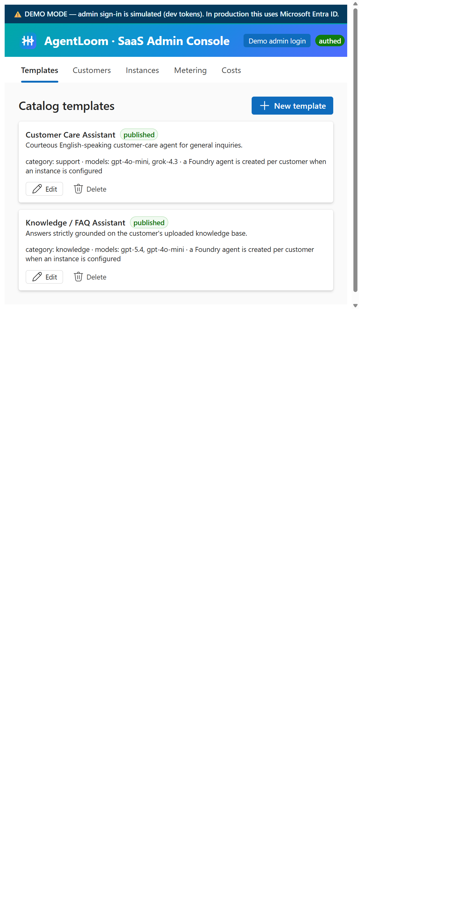
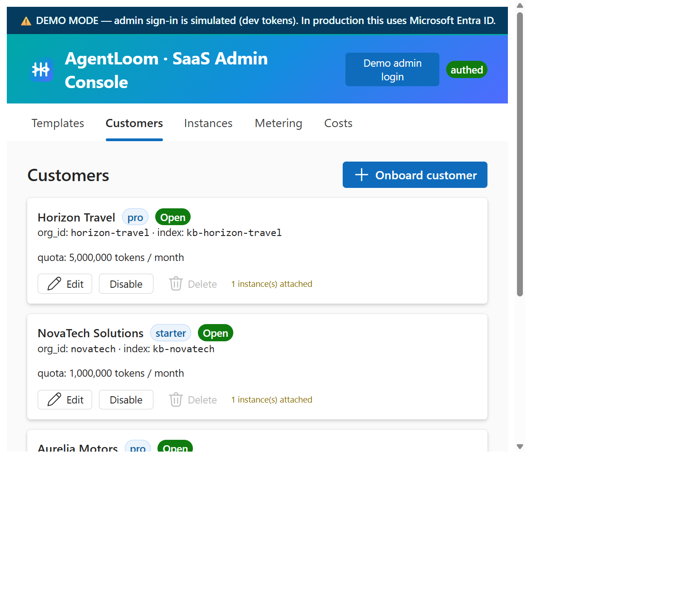
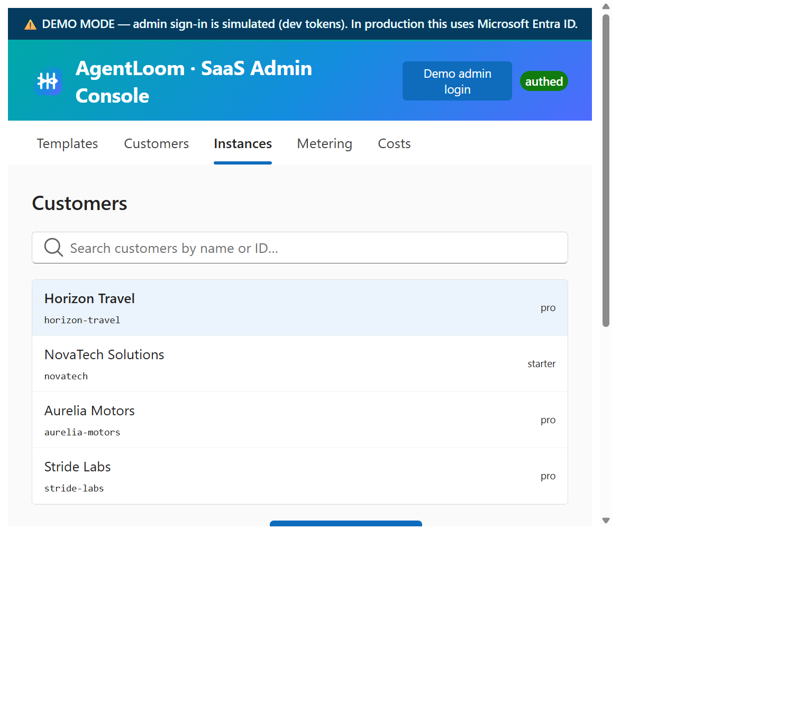
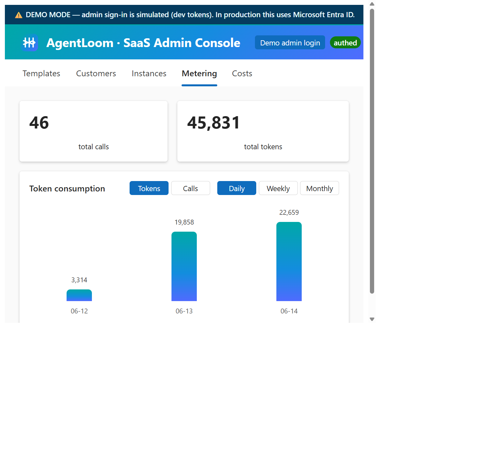
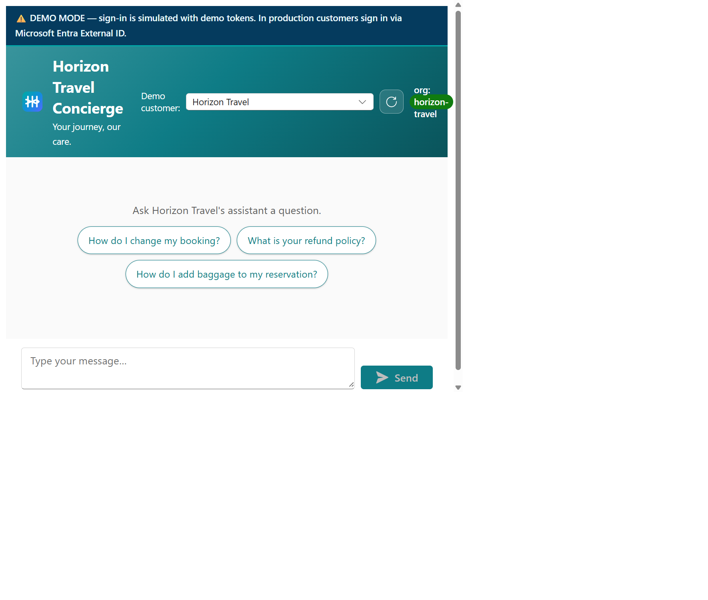
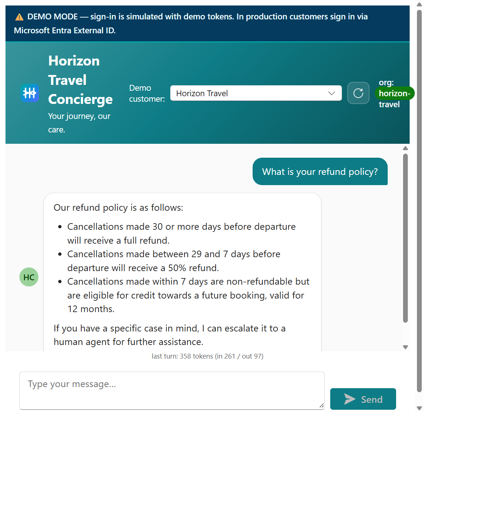

# Walkthrough

A quick tour of the two apps. Screenshots live in
[`screenshots/`](screenshots/) — see that folder's README for the exact files to
capture if any image below is missing.

> Looking for the project overview? Head back to the
> [main README](../README.md).

## SaaS Admin Console (provider)

The provider's operators sign in to the **SaaS Admin Console** (the
`admin-designer` app) to manage the whole catalog → customers → instances
lifecycle and watch usage and cost.

**1. Templates** — the catalog of reusable agent blueprints. Publish a template
to make it selectable when onboarding customers.

**2. Customers** — onboard a customer: its `org_id`, tier/quota and branding.
Saving auto-creates the per-customer Search index `kb-{org_id}`.

**3. Instances** — assign a template to a customer, upload knowledge (chunked
and embedded for RAG), and toggle **agentic retrieval** where the template
allows it.

**4. Metering** — per-customer usage: tokens and calls over time (daily / weekly
/ monthly) plus a breakdown by instance.

**5. Costs** — the monthly Azure bill attributed per customer: fixed shared
platform + variable AI usage (LLM tokens, embeddings, agentic planning), with an
end-of-month projection and a USD/EUR switch.

## Customer chat (end user)

Each customer's users only ever see the **brandable chat** (`customer-webapp`).
They never touch any infrastructure; isolation is enforced server-side by their
`org_id`.

**Welcome screen** — the customer's brand (name, color, logo) plus clickable
**suggested-question** chips configured per instance.

**Grounded answer** — the agent answers using *that customer's* knowledge
(vector + semantic search, or agentic retrieval), streamed token-by-token and
rendered as markdown.

